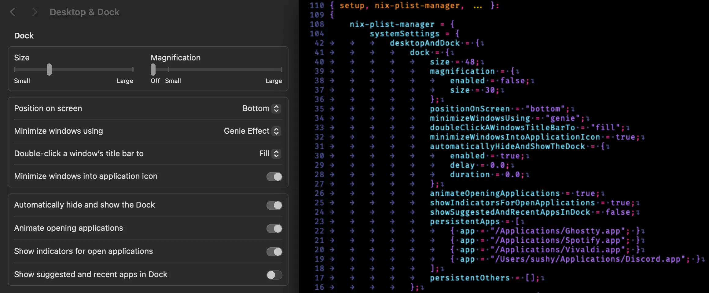

# nix-plist-manager

A Nix module for managing macOS system settings through plist files. This module provides a declarative way to configure various macOS system preferences using nix-darwin.



## Dependencies

This module requires [nix-darwin](https://github.com/nix-darwin/nix-darwin) to function properly.

## Installation

Add this flake to your nix-darwin configuration:

```nix
{
  inputs = {
    nixpkgs.url = "github:nixos/nixpkgs/nixos-unstable";
    nix-darwin.url = "github:nix-darwin/nix-darwin";
    nix-darwin.inputs.nixpkgs.follows = "nixpkgs";
    nix-plist-manager.url = "github:sushydev/nix-plist-manager";
  };

  outputs = { self, nix-darwin, nix-plist-manager, ... }: {
    darwinConfigurations."your-hostname" = nix-darwin.lib.darwinSystem {
      modules = [
        nix-plist-manager.darwinModules.default
        ./configuration.nix
      ];
    };
  };
}
```

## Usage

Enable the module and configure your desired settings:

```nix
{ config, ... }:

{
  nix-plist-manager = {
    enable = true;
    users = [ "your-username" ];

    systemSettings = {
      general = {
        softwareUpdate = {
          automaticallyDownloadNewUpdatesWhenAvailable = true;
          automaticallyInstallMacOSUpdates = false;
        };
      };

      appearance = {
        appearance = "Dark";
        accentColor = "Blue";
      };

      desktopAndDock = {
        dock = {
          size = 64;
          positionOnScreen = "bottom";
        };
      };
    };

    finder = {
      removeItemsFromTheTrashAfter30Days = true;
    };
  };
}
```

## Supported Settings

See [SUPPORTED_SETTINGS.md](SUPPORTED_SETTINGS.md) for a complete list of all supported system settings and their configuration options.

## Contributing

Contributions are welcome! Please see the [SUPPORTED_SETTINGS.md](SUPPORTED_SETTINGS.md) file to check which settings are not yet implemented and help expand the module's capabilities.

## License

This project is licensed under the [GNU General Public License](LICENSE.md) License.
